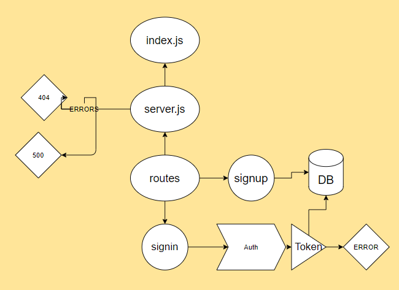
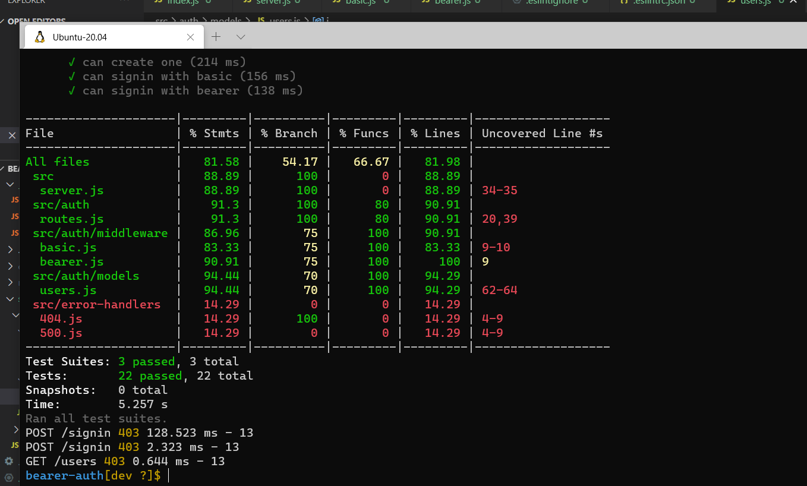

# bearer-auth

## Bearer-auth
## Author: Abdalrhman Albdahat
## lab7
## working branch :dev
####  links:
- [Heroku](https://boodah-bearer.herokuapp.com/s)
- [GitHub-repo](https://github.com/boodah96/bearer-auth)
- [PR](https://github.com/boodah96/bearer-auth/pull/1)
- ### Start work with this commands:

- npm init -y

- npm i express dotenv morgan jsonwebtoken base-64 bcrypt cors mongoose

- to test follow these command:

- npm i jest supertest @code-fellows/supergoose
- npm test 
- all tests work locally but I have a problem on GitHup tests 

- heroku test: https://boodah96-basicauth.herokuapp.com/ 
- ##  UML diagram:

## tests
